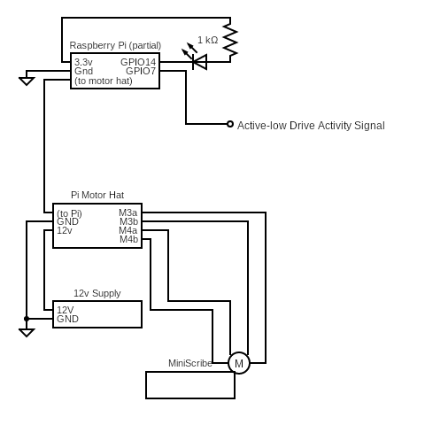

# PiScribe
Make vintage MiniScribe hard drive sounds on your modern hardware

For dev updates see [the TinkerDifferent thread](https://tinkerdifferent.com/threads/driving-a-miniscribe-motor-to-make-vintage-sounds.2904/#post-25010).

# WARNING
**WARNING This will probably destroy your MiniScribe's platters so don't do this on a MiniScribe that you care about!!**
The author is in no way responsible for loss of data or damage to hardware.  If you don't know what you're doing feel free to post questions or e-mail me but know this software and solution is at your/your hardware's own risk!!

## What is it?
PiScribe is a python script made for use with some additional hardware (which? more on that later) so that a [MiniScribe](https://en.wikipedia.org/wiki/MiniScribe) hard drive can produce its unique stepper-motor sounds based on what your more modern hard drive is doing.
Currently - the code is designed for use on a Raspberry Pi with [DC/stepper motor hat](https://learn.adafruit.com/adafruit-dc-and-stepper-motor-hat-for-raspberry-pi) but the code is probably very portable onto other solutions in driving the motor, if only as a reference.  Beyond the motor hat, this code makes uses of two additional GPIO pins in order to monitor for drive activity and to blink a new LED (optional) to indicate activity.

## Why did you make this?
I have an [old computer](https://en.wikipedia.org/wiki/Macintosh_SE) with a MiniScribe hard drive that doesn't work and I added a [SCSI-to-SD card](https://bluescsi.com) storage solution but I miss those authetic vintage sounds.  So I decided to find a way to externally drive the mechanism to make the noises.  

## How do I use it?
You need to have all the equipment necessary to drive a bipolar stepper motor.  In the case of the Macintosh SE's MiniScribe 8425 drive, you need a 12V power supply plus motor driver hardware plus microprocontroller/microprocessor to run the code and manage the motor driver.  In my case, the BOM is as follows:
### BOM
1.  Raspberry Pi (I used a Pi 3)
2.  DC / Stepper Motor Hat
3.  12V power supply (mine was 1.5A capable but I do not believe it comes close to using that much current, note you could use your computer's built-in power supply in many cases)
4.  General wires
    1. To connect the motor to the motor driver
    2. To connect the power supply to the motor driver
    3. To connect some Raspberry Pi GPIO pins to the activity LED or activity signal on whatever modern drive you want to make noises for
5.  Optional LED if you want to test/monitor when PiScribe is making hard drive sounds (useful if, say, your computer has/had an LED to indicate activity that you want to replace/use -- as was the case in my Macintosh SE

### Setup
1. **WARNING This will probably destroy your MiniScribe's platters so don't do this on a MiniScribe that you care about!!**
1. Disconnect power from the hard drive
1. Disconnect the stepper motor
1. Setup the Raspberry Pi with the [appropriate Motorkit libraries](https://learn.adafruit.com/adafruit-dc-and-stepper-motor-hat-for-raspberry-pi/installing-software) the Raspberry Pi i2c [communication speed set to 800 KHz](https://www.raspberrypi-spy.co.uk/2018/02/change-raspberry-pi-i2c-bus-speed/)
1. Connect all your motor/motor driver/power supply stuff together
1. Connect a wire from Raspberry Pi GPIO pin 4 the **active-low** activity pin
   1.  **WARNING** if you have an active-high activity pin then you'll need to modify the code to avoid a short!!
1. *(Optional)* - Connect a wire from Raspberry Pi GPIO pin 17 and an LED+resistor
   1.  **WARNING** the code expects the LED circuit to be active-low such that GPIO 17 set to LOW should make the LED turn on
1. Position the motor so that it is in a neutral position (i.e. centered between its start and end stops)
1. Run the ```PiScribe.py``` script.  The motor should go through a simulated startup process and then proceed to make fun hard drive noises when the GPIO pin 4 activity signal triggers

If you want a head-less solution you could surely make the Raspberry Pi automatically run the PiScribe.py script at startup so you don't need to kick it off manually.

## Reference Design
The following is a reference design for the system as per the BOM, above.


## File Descriptions
*(non-functional files omitted)*
1. PiScribe.py - the python code for all the functionality in this repo
1. i2cspeed.sh - a script to check your current Raspberry Pi's i2c communication speed setting
